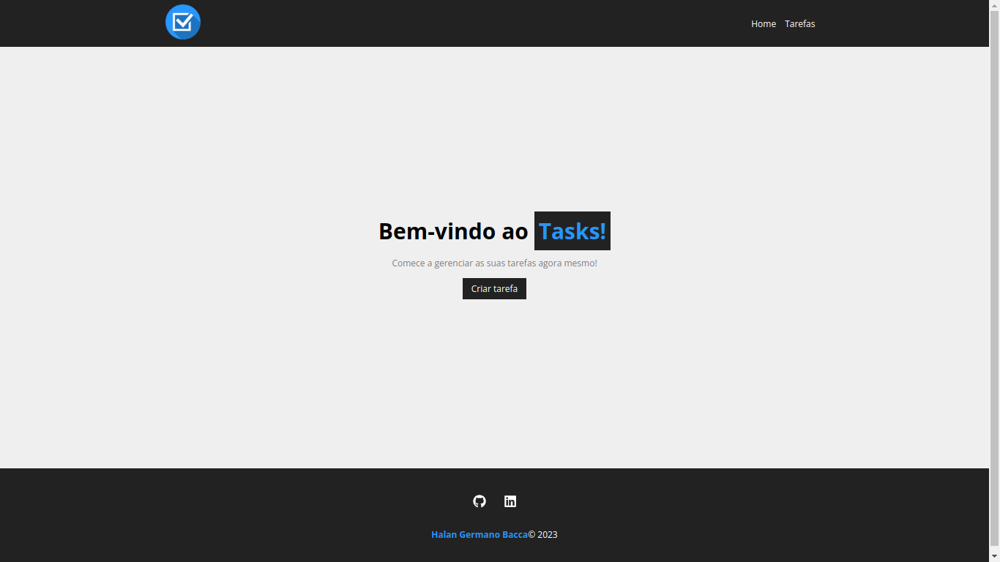

# Desafio BrickUp - Tasks!



> Tela Inicial do Sistema.


> Tela de Tarefas do Sistema.

### Descrição do Projeto

Criar um sistema no qual é possível cadastrar e concluir tarefas em uma interface web. O servidor deverá armazenar as informações em um banco de dados MySQL e salvar a foto em arquivo ou no próprio banco de dados, fornecendo os endpoints REST para a interface web.

## 💻 Pré-requisitos

Antes de começar, verifique se você atende aos seguintes requisitos:

<!---Estes são apenas requisitos de exemplo. Adicionar, duplicar ou remover conforme necessário--->

- Você possui a versão mais recente do `React 18.2.0` instalado.

### Configuração da API REST

```
# Iniciando o servidor
Certifique-se de que tenha o MySQL instalado em sua máquina.
Certifique-se que o MySQL esteja em executação na sua máquina.
Executar a API REST desenvolvida em Java e Spring.
Lembrando que por padrão a API vai funcionar no endereço: http://localhost:8080.
```

### Inicialização do Aplicativo

```
# Baixando o projeto
Após clonar o projeto execute o comando: npm install.
Caso encontre alguma vulnerabilidade execute o comando: npm audit fix.

# Executando o projeto
Inicializar o projeto com npm start.
Lembrando que por padrão o projeto vai funcionar no endereço: http://localhost:3000.
```
